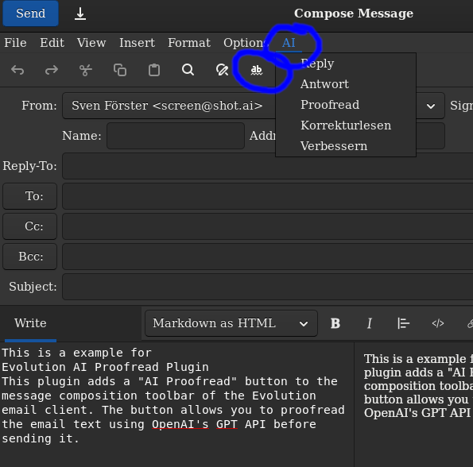

# AI-Proof Read Plugin

This plugin adds a `Spellcheck` (AI-Proof Read) button to the main
message composition toolbar of the Evolution email client. The
button lets you proofread or spellcheck the email text using OpenAI's
GPT API before sending it. There is also an `AI` field in the menubar
for quick access to AI features.



## Configuration

You need to set your OpenAI API key in the authinfo file. The format of the file is:

```
machine api.openai.com login apikey password <key>
```

You can find the authinfo file in your home directory under `~/.authinfo`. If the file does not exist, you can create it.

You need to create a `prompts.json` file in the `ai-proofread/prompts.json` under evolution user config directory. On linux it is `/.config/evolution/ai-proofread/prompts.json`.

The `prompts.json` file should contain an array of prompts. Each prompt should have an id (show in menu and on toolbar combo box) and a text. The text is the prompt text sent to the ChatGPT.

Example:

```json
[
    {"id": "proofread-1", "text": "You are a proofreader. Proofread the following text and return the corrected text."}
]
```

(see `prompts.json` for more examples)

## Usage

After installing the plugin, use the toolbar prompt selector and click the `Spellcheck` (AI-Proof Read) button in the main message composition toolbar, or use the `AI` entry in the menubar.

By default it inserts the proofread text into the message body at the cursor position. To replace the original text, select the text first and then click the `Spellcheck` button.

## Building

``` bash
cmake -B build -G Ninja -DCMAKE_INSTALL_PREFIX=~/.local/share/evolution/modules -DFORCE_INSTALL_PREFIX=ON .
cmake --build build
cmake --install build
```

or steigt from vs code

`Ctrl+Shift+P` and select `CMake: Build`.
`Ctrl+Shift+P` and select `CMake: Install`.


## Development

To use under vscode first generate `compile_commands.json`:

```
$ cmake -DCMAKE_EXPORT_COMPILE_COMMANDS=ON .
```

## Debugging

To debug the plugin, run Evolution with debug output enabled:

```bash
G_MESSAGES_DEBUG=all GTK_DEBUG=all evolution 2>&1 | tee evolution-debug.log
```

This will display detailed debug messages from GLib and GTK and save them to `evolution-debug.log` for later analysis.

## Future plans

I primarily use this plugin myself, so the features are tuned for my needs. However I'm open to suggestions and pull requests.
Some ideas:

- Replace all reply text with the proofread text without the need to select it first.
- UI for configuring prompts.
- Support for other LLM providers (e.g. Anthropic).
- UI for configuring LLM provider keys and other options (e.g. model, temperature, etc.).
- Package for Ubuntu and other distros.

## License

This plugin is open-source and licensed under the GPL License.

## Author

Vadim Zaliva, 2024
Upgraded to GTK 4.10 by Sven Förster, 2025
